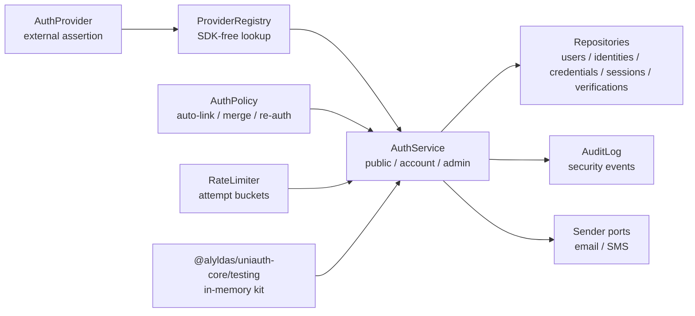
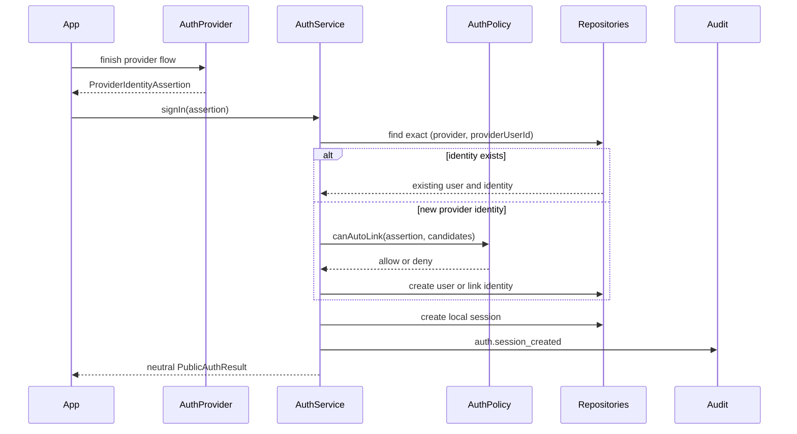
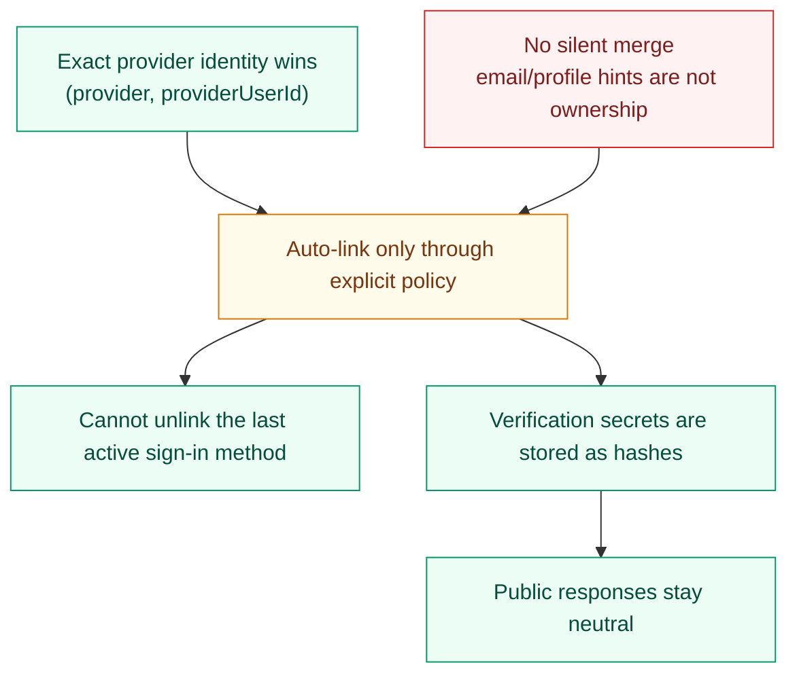

# UniAuth Core

[](https://github.com/alyldas/uniauth-core/actions/workflows/ci.yml)
[](package.json)
[](LICENSE)
[](https://www.typescriptlang.org/)
[](https://github.com/users/alyldas/packages/npm/package/uniauth-core)

`@alyldas/uniauth-core` is an ESM-only headless identity orchestration core for TypeScript and Node.js.

It models users, identities, credentials, verifications, sessions, account linking policy, and
storage/provider ports without owning UI, HTTP routes, cookies, an ORM, or a hosted auth service.

The package is source-available under the PolyForm Strict License 1.0.0. Commercial use,
redistribution, making changes, or creating new works based on the software require a separate paid
license, subscription, private contract, or other written permission.

## What This Package Does

- Models `User`, `AuthIdentity`, `Credential`, `Verification`, and `Session` separately.
- Treats email and phone as optional identity attributes, not mandatory user fields.
- Orchestrates `signIn`, `link`, `unlink`, `mergeAccounts`, verification, and session revocation.
- Starts and finishes generic OTP challenges over email or phone through sender ports.
- Resends OTP challenges, magic links, and password-recovery links through explicit execution APIs.
- Starts and finishes email magic-link sign-in on the shared verification lifecycle.
- Hashes password credentials through a password hasher port, stores them through a credential repo,
  and signs in with a local password identity.
- Starts and finishes email password recovery on the shared verification lifecycle.
- Validates signed Telegram Mini App and MAX WebApp `initData` without provider SDK lock-in.
- Maps SDK-free OAuth/OIDC provider profiles into the existing provider sign-in pipeline.
- Creates local session records after successful sign-in.
- Exposes local session read-side helpers for token resolution, trusted session-context resolution,
  activity touch, and user session listing.
- Exposes a narrow `getUser(userId)` helper for loading the active local user snapshot by id.
- Exposes read-side helpers for credential and verification lookups through the public service
  layer.
- Exposes trusted resend/cooldown reads for verification-backed OTP, magic-link, and recovery
  flows.
- Exposes trusted cancellation APIs for verification-backed OTP, magic-link, and recovery flows.
- Exposes trusted resend execution APIs for verification-backed OTP, magic-link, and recovery
  flows.
- Exposes public audit-event slice and page read-side APIs for trusted security timelines and
  support tooling.
- Exposes safe projection helpers for account-security and verification-status read-side flows.
- Exposes an aggregated `getAccountSecuritySnapshot(userId)` read-side API for account-security
  screens.
- Exposes a current-account aggregate helper and token-based self-service session revoke helpers for
  trusted account-security routes after transport resolution.
- Exposes current-account inspection aggregate and audit-page helpers for self-service security
  routes that already trust a local session token.
- Exposes token-based current-account write-side helpers for sign-in-method link/unlink,
  selected-session revoke, verified contact changes, account closure, and local password setup or
  change after transport resolution.
- Exposes current-account OTP and password re-auth helpers for self-service recent-auth bootstrapping
  on the trusted local session-token boundary.
- Exposes a trusted `getAccountInspectionSnapshot({ userId, audit? })` aggregate read-side
  API for backend support and admin inspection flows.
- Supports bulk local session revocation for sign-out-all-devices style account-security flows.
- Uses explicit policy for auto-linking, unlinking, re-auth, and account merge decisions.
- Runs transaction-aware account merge over identities, credentials, sessions, and audit decisions
  when the configured `UnitOfWork` supports atomic rollback.
- Exposes ports for repositories, providers, sender infrastructure, rate limits, password hashing,
  audit logs, and transactions.
- Exposes public rate-limit helpers for key composition and typed rate-limit error inspection.
- Ships an in-memory testing implementation through `@alyldas/uniauth-core/testing`.

## What It Does Not Do

- It is not a hosted auth service.
- It does not ship frontend pages or UI components.
- It does not include Express, Fastify, Nest, Nuxt, or Next handlers in core.
- It does not generate one mandatory ORM schema.
- It does not include SMTP, SMS gateway, OAuth/OIDC, Telegram, or MAX SDKs, bot setup, webhook
  handlers, or frontend bridge code in core.
- It does not embed Better Auth or Auth.js runtime, session stores, cookies, callbacks, or plugin
  wiring into core.
- It does not send messages by itself; OTP, magic-link, and recovery delivery use sender ports you
  provide.
- It does not bundle a password hashing runtime; password hashing uses a `PasswordHasher` adapter you
  provide.
- It does not ship a production Redis, database, or edge rate limiter.
- It does not silently merge two existing users by email.

## Diagrams



`DefaultAuthService` keeps the flat method surface for compatibility, but the canonical route
surface is grouped by security boundary:

```ts
await auth.public.password.signIn({ email, password })
await auth.public.otp.start({ target, channel })
await auth.public.magicLink.finish({ verificationId, secret })
await auth.public.passwordRecovery.start({ email, createLink })

await auth.account.profile.update({ sessionToken, displayName })
await auth.account.contact.start({ sessionToken, target, channel })
await auth.account.password.change({ sessionToken, currentPassword, newPassword })
await auth.account.reAuth.assert({ sessionToken, reAuthenticatedAt })
await auth.account.sessions.revokeOther({ sessionToken })
await auth.account.security.snapshot({ sessionToken })

await auth.admin.users.get(userId)
await auth.admin.users.sessions(userId)
await auth.admin.accounts.merge({ sourceUserId, targetUserId, sourceSessionToken })
await auth.admin.verifications.get(verificationId)
await auth.admin.audit.page({ userId })
```

`auth.public` sign-in methods return `PublicAuthResult`: user, identity, and session views plus the
one-time `sessionToken`, without server-only hashes such as `tokenHash`, `passwordHash`, or
`secretHash`.





## Install

Install from GitHub Packages:

Configure the GitHub Packages registry for the package scope before installing:

```text
@alyldas:registry=https://npm.pkg.github.com
```

GitHub Packages can require authentication for package reads. Use a token with `read:packages` in
local npm config or CI secrets; do not commit tokens.

```sh
npm install @alyldas/uniauth-core
```

## Runtime Contract

The package targets modern ESM TypeScript consumers on Node.js 22 or newer.
The repository keeps `.node-version` as the local Node.js 22 runtime marker.

Core imports come from the root entry point:

```ts
import {
  DefaultAuthService,
  EMAIL_MAGIC_LINK_PROVIDER_ID,
  EMAIL_OTP_PROVIDER_ID,
  OtpChannel,
  PASSWORD_PROVIDER_ID,
  ProviderTrustLevel,
  RateLimitAction,
  UniAuthError,
  UniAuthErrorCode,
  VerificationPurpose,
  compatibilityAuthNormalizer,
  createAuthNormalizer,
  createDefaultAuthPolicy,
  createHmacSecretHasher,
  createScryptSecretHasher,
  getRateLimitedErrorDetails,
  isUniAuthError,
  rateLimitKey,
  toAccountSecuritySnapshot,
  toVerificationResendWindow,
  toVerificationStatusView,
  type AuthNormalizer,
  type AuthProvider,
  type AuthService,
  type EmailMagicLink,
  type EmailPasswordRecoveryLink,
  type PasswordHasher,
  type PasswordPolicy,
  type ProviderIdentityAssertion,
  type RateLimiter,
  type SecretHasher,
} from '@alyldas/uniauth-core'
```

Testing helpers come from the explicit testing entry point:

```ts
import {
  InMemoryEmailSender,
  InMemoryPasswordHasher,
  InMemoryRateLimiter,
  InMemorySmsSender,
  StaticAuthProvider,
  createInMemoryAuthKit,
} from '@alyldas/uniauth-core/testing'
```

Shared runtime and infrastructure contracts can come from a dedicated contracts entry point:

```ts
import type {
  AuthNormalizer,
  AuthProvider,
  AuthServiceInfrastructure,
  Clock,
  IdGenerator,
  PasswordHasher,
  PasswordPolicy,
  ProviderRegistry,
  RateLimiter,
  SecretHasher,
  UnitOfWork,
} from '@alyldas/uniauth-core/contracts'
```

There are no root side effects. Importing the package does not register providers, touch storage,
create sessions, read environment variables, or mutate global state.

Normalization can be shared through one optional runtime boundary:

```ts
const strictNormalizer: AuthNormalizer = createAuthNormalizer({
  normalizeEmail(email) {
    const normalized = compatibilityAuthNormalizer.normalizeEmail(email)

    if (!/^[^\s@]+@[^\s@]+\.[^\s@]+$/u.test(normalized)) {
      throw new UniAuthError(UniAuthErrorCode.InvalidInput, 'Email is invalid.')
    }

    return normalized
  },
  normalizePhone(phone) {
    const digits = phone.replace(/\D+/g, '')
    const normalized = digits.length === 10 ? `+1${digits}` : `+${digits}`

    if (!/^\+[1-9]\d{7,14}$/u.test(normalized)) {
      throw new UniAuthError(UniAuthErrorCode.InvalidInput, 'Phone is invalid.')
    }

    return normalized
  },
})

const { service } = createInMemoryAuthKit({
  normalizer: strictNormalizer,
})
```

The service contract is policy-driven:

```ts
const policy = {
  ...createDefaultAuthPolicy({
    allowAutoLink: true,
    allowMergeAccounts: false,
  }),
  canAutoLink(context) {
    return (
      context.assertion.trust?.level === ProviderTrustLevel.Trusted &&
      context.existingIdentities.every(
        (identity) => identity.trust?.level !== ProviderTrustLevel.Untrusted,
      )
    )
  },
}

const { service } = createInMemoryAuthKit({
  policy,
})

const result = await service.public.provider.signIn({
  assertion: {
    provider: 'email-otp',
    providerUserId: 'alice@example.com',
    email: 'alice@example.com',
    emailVerified: true,
    trust: {
      level: ProviderTrustLevel.Trusted,
      signals: ['first-party-email'],
    },
  },
})
```

For account-security or verification-status pages, prefer the built-in read-side and projection
helpers instead of serializing raw entities directly:

```ts
const snapshot = await service.admin.users.securitySnapshot(userId)

const verificationStatus = toVerificationStatusView(verification)
```

When the caller is already authenticated by a trusted local `sessionToken`, prefer the aggregate
helper instead of manually composing `resolveSessionContext(...)` and `getAccountSecuritySnapshot(...)`:

```ts
const current = await service.account.security.snapshot({
  sessionToken,
  touch: true,
})
```

When the current account page also needs a bounded self-service audit timeline, prefer the current
inspection aggregate instead of mixing current-account and admin-oriented helpers:

```ts
const currentInspection = await service.account.inspection.snapshot({
  sessionToken,
  touch: true,
  audit: {
    limit: 20,
  },
})
```

Before destructive account closure, a self-service route can also stay on the trusted token
boundary and return a safe pre-closure auth snapshot:

```ts
const closureExport = await service.account.inspection.closureExport({
  sessionToken,
  audit: {
    limit: 50,
  },
})
```

Trusted backend tooling can start from one trusted aggregate inspection helper:

```ts
const inspection = await service.admin.users.inspectionSnapshot({
  userId,
  audit: {
    limit: 20,
  },
})
```

If the surrounding tooling truly needs raw audit entities, custom filters, or metadata-aware
serialization, `getAuditEvents(...)` and `getAuditEventPage(...)` remain available as the narrower
read-side primitives. Self-service current-account routes that need timeline pagination can stay on
the trusted token boundary through `account.inspection.auditPage(...)`.

The same trusted token boundary can also own self-service account mutations:

```ts
await service.account.profile.update({
  sessionToken,
  displayName,
  reAuthenticatedAt,
})

const contactChange = await service.account.contact.start({
  sessionToken,
  channel: OtpChannel.Email,
  target: newEmail,
  reAuthenticatedAt,
})

await service.account.contact.finish({
  sessionToken,
  verificationId: contactChange.verificationId,
  secret: code,
})

await service.account.sessions.revokeOwned({
  sessionToken,
  targetSessionId,
})

await service.account.identities.unlink({
  sessionToken,
  identityId,
  reAuthenticatedAt,
})

await service.account.identities.link({
  sessionToken,
  assertion,
  reAuthenticatedAt,
})

await service.account.closure.close({
  sessionToken,
  reAuthenticatedAt,
})
```

The same trusted boundary can bootstrap recent-auth proof for those sensitive current-account
mutations:

```ts
const challenge = await service.account.reAuth.startOtp({
  sessionToken,
  identityId,
  channel: OtpChannel.Email,
})

const resent = await service.account.reAuth.resendOtp({
  sessionToken,
  verificationId: challenge.verificationId,
})

const otpConfirmation = await service.account.reAuth.finishOtp({
  sessionToken,
  verificationId: resent.verificationId,
  secret: codeFromUserInput,
})

const passwordConfirmation = await service.account.reAuth.confirmPassword({
  sessionToken,
  currentPassword,
})

passwordConfirmation.currentSessionId
passwordConfirmation.reAuthenticatedAt

const reAuthStatus = await service.account.reAuth.status({
  sessionToken,
  action: AuthPolicyAction.ChangePassword,
  reAuthenticatedAt: otpConfirmation.reAuthenticatedAt,
})
```

Trusted resend and cooldown polling can use one read-side helper per verification:

```ts
const resendWindow = await service.admin.verifications.resendWindow({
  verificationId,
  cooldownSeconds: 60,
})
```

Provider adapters are external integration code. They should return a validated
`ProviderIdentityAssertion`, while SDK setup, OAuth/OIDC callbacks, messenger launch validation,
token persistence, cookies, and redirects stay application-owned or adapter-package-owned.

Persistence lives in external adapter packages or application-owned repository implementations so
the core API stays ORM-free and does not take a hard runtime dependency on a database driver.

Public error helpers use the `UniAuth` brand casing:

```ts
try {
  await service.public.provider.signIn({})
} catch (error) {
  if (isUniAuthError(error) && error.code === UniAuthErrorCode.InvalidInput) {
    throw new UniAuthError(UniAuthErrorCode.InvalidInput, error.message)
  }
}
```

Rate limiting is optional and app-owned. Core calls a `RateLimiter` port before security-sensitive
attempts and turns a denied decision into a stable `UniAuthErrorCode.RateLimited` error without
creating users, sessions, or consuming OTP verifications. Production bootstraps can set
`requireRateLimiter: true` so local auth flows fail fast if a limiter was not wired. Password
strength checks are also optional and app-owned through `PasswordPolicy`; production bootstraps can
set `requirePasswordPolicy: true` to fail fast when password flows are enabled without that policy.

```ts
const rateLimiter: RateLimiter = {
  async consume(input) {
    if (input.action === RateLimitAction.OtpStart) {
      return { allowed: false, retryAfterSeconds: 60 }
    }

    return { allowed: true }
  },
}

const { service } = createInMemoryAuthKit({ rateLimiter })
```

OTP sign-in is still headless: `public.otp.start` creates a hashed verification secret and sends the
plain code through the configured sender port; `public.otp.signIn` consumes the code once and creates
a local session. Email and phone OTP both use this unified API.

```ts
const { service } = createInMemoryAuthKit()

const challenge = await service.public.otp.start({
  purpose: VerificationPurpose.SignIn,
  channel: OtpChannel.Email,
  target: 'alice@example.com',
  secret: '123456',
})

const result = await service.public.otp.signIn({
  verificationId: challenge.verificationId,
  secret: '123456',
  channel: OtpChannel.Email,
})

console.log(result.identity.provider === EMAIL_OTP_PROVIDER_ID)
```

Core-owned verification routing fields, such as `provider` and `channel`, are stored separately
from app-owned `metadata`.

OTP generation and the built-in email subject are configurable through service options. A
per-request `secret` still wins over the configured generator.

```ts
const { service } = createInMemoryAuthKit({
  emailOtpSubject: 'Your Example App code',
  otpSecretLength: 8,
  otpSecretGenerator: ({ target }) => `app-owned-code-for:${target}`,
})
```

Email magic links also use the same hashed verification lifecycle. Core does not own your route,
domain, redirect handling, or cookie transport; the application provides a `createLink` function and
an `EmailSender`.

```ts
const magicLink = await service.public.magicLink.start({
  email: 'alice@example.com',
  createLink(input: EmailMagicLink) {
    return `/auth/magic?verification=${input.verificationId}&token=${input.secret}`
  },
})

const magicResult = await service.public.magicLink.finish({
  verificationId: magicLink.verificationId,
  secret: 'token-from-request',
})

console.log(magicResult.identity.provider === EMAIL_MAGIC_LINK_PROVIDER_ID)
```

Password credentials use a dedicated `CredentialRepo`, a `PasswordHasher` port, and an optional
`PasswordPolicy` port for new password material. Production apps should provide adapters backed by
their chosen password hashing runtime, parameters, and strength or breached-password policy; the
in-memory testing kit only ships a low-cost `scrypt` test hasher.

```ts
const passwordHasher: PasswordHasher = {
  async hash(password) {
    return hashPassword(password)
  },
  async verify(password, passwordHash) {
    return verifyPassword(passwordHash, password)
  },
}

const passwordPolicy: PasswordPolicy = {
  validate({ password }) {
    if (password.length < 12) {
      return { allowed: false, reason: 'Password is too weak.' }
    }
  },
}

const { service } = createInMemoryAuthKit({ passwordHasher, passwordPolicy })

await service.account.password.set({
  sessionToken,
  password: 'new password from settings form',
  reAuthenticatedAt,
})

const passwordResult = await service.public.password.signIn({
  email: 'alice@example.com',
  password: 'password from sign-in form',
})

console.log(passwordResult.identity.provider === PASSWORD_PROVIDER_ID)
```

Password recovery is an email verification flow. Core creates a hashed recovery secret and calls
your `createLink` function; your application owns the route and reset form.

```ts
const recovery = await service.public.passwordRecovery.start({
  email: 'alice@example.com',
  createLink(input: EmailPasswordRecoveryLink) {
    return `/auth/recovery?verification=${input.verificationId}&token=${input.secret}`
  },
})

await service.admin.credentials.finishPasswordRecovery({
  verificationId: recovery.verificationId,
  secret: 'token-from-request',
  newPassword: 'new password from reset form',
})
```

OTP delivery is outside the storage transaction. `startOtpChallenge` first persists the hashed
verification record, then calls the configured sender port. If the sender rejects, the pending
verification remains in storage until it is consumed, expires, or is cleaned up by your adapter.
This keeps external SMTP/SMS/queue side effects out of `UnitOfWork`. Queue-backed delivery should
wrap `EmailSender` or `SmsSender` instead of introducing a new core dispatcher, and exhausted
delivery remains adapter-owned state rather than a new core verification status. See
[OTP delivery boundary](docs/otp-delivery.md).

Email and phone normalization stay intentionally lightweight in the root helpers so the package does
not silently impose one production syntax or phone metadata policy on every consumer. Current
exports remain compatibility-oriented; stricter validation, E.164 canonicalization guidance, and
migration cautions are documented in [Normalization boundary](docs/normalization.md).

Verification hashing is pluggable. The default hasher is salted `scrypt` so short OTP values are not
stored as fast hashes. Production deployments that need app-owned key material can still provide an
HMAC pepper through `createHmacSecretHasher` or a custom `SecretHasher` implementation:

```ts
import { createHmacSecretHasher } from '@alyldas/uniauth-core'
import { createInMemoryAuthKit } from '@alyldas/uniauth-core/testing'

const secretPepper = process.env.UNIAUTH_SECRET_PEPPER

if (!secretPepper) {
  throw new Error('UNIAUTH_SECRET_PEPPER is required.')
}

const { service } = createInMemoryAuthKit({
  secretHasher: createHmacSecretHasher({
    pepper: secretPepper,
  }),
})
```

The package never reads environment variables by itself; application bootstrap code owns secret
loading and rotation policy.

## Adapter Author Guide

Storage adapters should preserve these invariants:

- Keep `User` and `AuthIdentity` as separate records.
- Enforce uniqueness for `(provider, providerUserId)`.
- Run link, unlink, merge, session, and verification writes inside the provided transaction boundary.
- Store verification secrets only through the configured `SecretHasher`.
- Store client session tokens only as server-side hashes.
- Do not infer ownership from email, phone, or provider profile metadata outside `AuthPolicy`.
- Keep sender side effects outside storage transactions.

Provider adapters should return a normalized `ProviderIdentityAssertion` from `finish()`. Raw
provider payloads should stay adapter-owned or be reduced to explicit `metadata`; core does not
persist raw provider profiles.

## Entry Points

- `@alyldas/uniauth-core`: public domain types, service implementation, policy API, ports, errors, and utilities.
- `@alyldas/uniauth-core/testing`: in-memory store, provider registry, static provider, in-memory email
  and SMS senders, and test kit.

## Attribution

The root entry point exposes attribution metadata and a pure helper for About, Legal, Notices, or
acknowledgements screens:

```ts
import { UNIAUTH_ATTRIBUTION, getUniAuthAttributionNotice } from '@alyldas/uniauth-core'

const metadata = UNIAUTH_ATTRIBUTION
const notice = getUniAuthAttributionNotice({ productName: 'Example App' })
```

The helper does not send telemetry, read environment variables, touch storage, or expose anything
automatically.

For commercial licensing, paid subscription terms, written agreements, or attribution questions,
contact `alyldas@ya.ru`.

## Examples

- [Basic Node example](examples/basic-node/index.ts)
- [Current-account contact change example](examples/current-account-contact-change/index.ts)
- [Link and unlink example](examples/link-unlink/index.ts)

## Documentation

- [Development](docs/development.md)
- [Architecture](docs/architecture.md)
- [Adapter author guide](docs/adapter-author-guide.md)
- [Backend integration recipes](docs/backend-recipes.md)
- [Account security recipes](docs/account-security.md)
- [Security model](docs/security.md)
- [Threat model](docs/threat-model.md)
- [Local auth flows](docs/local-auth.md)
- [OTP delivery boundary](docs/otp-delivery.md)
- [OTP and magic-link abuse-control recipes](docs/abuse-control.md)
- [Normalization boundary](docs/normalization.md)
- [Session transport recipes](docs/session-transport.md)
- [Support and admin inspection recipe](docs/support-inspection.md)
- [Licensing and attribution](docs/licensing.md)

## Generated Files

This repository keeps package source and documentation in git. Do not commit generated output:

- `dist`
- `coverage`
- `node_modules`
- `.npm-cache`
- `*.tgz`

`dist` is created by `npm run build`, `npm run test:exports`, and npm pack based commands
(`npm run lint:package`, `npm run test:types-package`, `npm run pack:dry`, release publish)
through `prepack`. `.npm-cache` stores npm cache and `_logs` locally so package checks do not
depend on a writable home directory.
`npm run prepare` only installs local Husky hooks when the project is inside a git repository.

`npm run lint:package` runs `publint` against the built package metadata, entry points, exports,
type declarations, and published file set.

`npm run test:types-package` runs `attw --pack . --profile esm-only` to verify package type
resolution from the packed tarball across modern ESM TypeScript consumer resolution modes. CommonJS
`require` is intentionally outside the support target for this ESM-only package.

To keep generated `dist` and `coverage` output inside a Node 22 Alpine container, run:

```sh
npm run check:docker
```

For the same package gate through Docker Compose, run:

```sh
npm run check:compose
```

## Release Checklist

Run the package gate before publishing:

```sh
npm run check
```

The gate runs formatting, ESLint, typecheck, 100% coverage, export smoke tests, package lint,
package type-resolution checks, local Markdown file, anchor, and image link checks, dependency
audit with `npm audit --audit-level=moderate`, and `npm pack --dry-run`.

The release workflow uses Release Please: pushes to `main` update a release PR, and merging that PR
creates the `v*` tag, GitHub release notes, and GitHub Packages publish. This repository uses the
`RELEASE_PLEASE_TOKEN` secret for release PR automation and `GITHUB_TOKEN` for package publishing.
Do not commit, amend, or force-push directly to `release-please--*` branches. Release changes must
land only by merging the Release Please PR into `main` after required checks pass and conversations
are resolved.

Normal feature, fix, refactor, docs, and test commits do not manually change release metadata.
Release Please owns these files in its release PR:

- `package.json`: package version.
- `package-lock.json`: lockfile package version.
- `CHANGELOG.md`: release section and compare links.

Only bypass that rule for an intentional manual release process.

Follow the changelog and merge policy in [CONTRIBUTING.md](CONTRIBUTING.md): regular feature and API
PRs should preserve useful Conventional Commits, while Release Please PRs can stay single release
commits.

After a release is published, verify the package page and GitHub Packages artifact manually against
the generated release notes and local `npm pack --dry-run` output.

## Contributing

See [CONTRIBUTING.md](CONTRIBUTING.md).

## Security

See [SECURITY.md](SECURITY.md).
