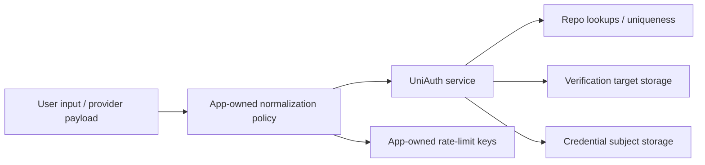

# Normalization Boundary

This document defines the production boundary for email and phone normalization in UniAuth.

It does not silently replace the current lightweight helpers with stricter behavior. Instead, it
defines what remains compatibility default, what production applications should own, and how future
strict normalization should be introduced without breaking identity matching semantics by surprise.

## Decision Summary

Keep the current exported helpers as compatibility utilities in `v0.13`:

- `normalizeEmail(...)` keeps trim + lowercase behavior;
- `normalizePhone(...)` keeps separator stripping behavior;
- `normalizeTarget(...)` keeps the current email-vs-phone heuristic.

Do not silently change those helpers into strict validators or provider-specific canonicalizers.

Production-grade validation and canonicalization should follow these rules:

- one shared normalization policy must be used across OTP, magic link, password, provider
  assertions, and repository lookup paths;
- email stays provider-agnostic in core, without mailbox-vendor alias rules;
- phone canonicalization should target E.164 when applications want production-stable phone
  identity matching;
- region-specific phone parsing must be explicit and application-owned or future-adapter-owned;
- no mandatory phone metadata dependency should be added to the core package.

Configurable strict normalization should stay on one shared runtime boundary, not split into ad hoc
flags for each auth flow.

## Runtime API

UniAuth now exposes one optional runtime-level normalization boundary through the `normalizer`
service option.

The boundary shape is:

- `normalizeEmail(email)`
- `normalizePhone(phone)`
- `normalizeTarget(target)`

The default runtime uses `compatibilityAuthNormalizer`, which preserves the historical lightweight
behavior. Applications can pass a stricter shared normalizer to `DefaultAuthService` or
`createInMemoryAuthKit`.

```ts
import {
  UniAuthError,
  UniAuthErrorCode,
  compatibilityAuthNormalizer,
  createAuthNormalizer,
} from '@alyldas/uniauth-core'
import { createInMemoryAuthKit } from '@alyldas/uniauth-core/testing'

const strictNormalizer = createAuthNormalizer({
  normalizeEmail(email) {
    const normalized = compatibilityAuthNormalizer.normalizeEmail(email)

    if (!/^[^\s@]+@[^\s@]+\.[^\s@]+$/u.test(normalized)) {
      throw new UniAuthError(UniAuthErrorCode.InvalidInput, 'Email is invalid.')
    }

    return normalized
  },
  normalizePhone(phone) {
    const digits = phone.replace(/\D+/g, '')
    const normalized = digits.length === 10 ? `+1${digits}` : `+${digits}`

    if (!/^\+[1-9]\d{7,14}$/u.test(normalized)) {
      throw new UniAuthError(UniAuthErrorCode.InvalidInput, 'Phone is invalid.')
    }

    return normalized
  },
})

const { service } = createInMemoryAuthKit({
  normalizer: strictNormalizer,
})
```

The important part is not the regex itself. The important part is that OTP, magic link, password,
verification, and provider-assertion paths all use the same configured normalizer object.

## Current Compatibility Mode

The current root exports are intentionally lightweight:

- `normalizeEmail(...)`: trims and lowercases;
- `normalizePhone(...)`: removes spaces, parentheses, dots, and dashes;
- `normalizeTarget(...)`: trims first, then routes to email normalization when the input contains
  `@`, otherwise to phone normalization.

Those helpers are good enough for:

- examples and tests;
- backward-compatible local development behavior;
- low-friction repository and verification demos.

They are not a complete production policy for:

- email syntax validation;
- mailbox-provider alias rules such as Gmail dot/plus handling;
- E.164 guarantees for phone storage and lookup;
- migration-safe canonicalization across persisted identities and credentials.

## Shared Flow Requirement

Applications should treat normalization as one cross-cutting identity policy, not as a per-endpoint
tweak.

The same normalized output must be used everywhere that a value becomes a lookup key or persisted
identifier:

- provider assertion mapping into `ProviderIdentityAssertion`;
- OTP target creation;
- email magic-link start;
- password credential email;
- repository lookup and uniqueness constraints;
- application-owned rate-limit keys built around normalized targets.



Mixing old and new normalized forms across these paths is unsafe. A deployment should not write one
format in OTP flows and a different one in password or provider flows.

## Email Policy

UniAuth keeps the current lowercase email compatibility behavior because most authentication systems
treat email lookup as case-insensitive in practice.

At the same time, core should not grow mailbox-vendor-specific ownership rules such as:

- Gmail dot folding;
- Gmail plus-tag stripping;
- Outlook alias collapsing;
- provider-specific hosted-domain heuristics.

Those rules are product policy, not universal auth-domain truth.

Production guidance:

- reject obviously malformed email input before creating OTP, magic-link, or recovery
  verifications;
- reject obviously malformed email input before creating or updating password credentials;
- if an application needs stricter syntax validation, do it through one shared policy that every
  local-auth path uses;
- if an application needs case preservation for display, keep a separate display value outside the
  canonical lookup key.

Email remains an optional identity attribute and, by itself, does not become proof of account
ownership.

## Phone Policy

Production phone matching should use canonical E.164 values when phone identity is meant to be
stable across flows and storage adapters.

Recommended guidance:

- if the application already collects E.164 input, keep UniAuth on that canonical form end to end;
- if the application accepts national-format input, the default region must be explicit in the
  application or future normalization adapter;
- core should not guess a region implicitly from process locale, deployment country, or user
  profile metadata;
- provider-specific raw phone strings should be normalized before they are relied on for matching
  or rate limiting.

UniAuth should not bundle a mandatory phone metadata/runtime dependency into the core package just
to support every numbering plan. If applications need region-aware canonicalization, that belongs in
an app-owned or optional-adapter-owned boundary.

## Invalid Input Behavior

When strict normalization is eventually wired into the runtime, invalid email or phone input should
fail as `invalid_input` before core creates new verifications or password credentials.

That behavior should apply consistently to:

- email OTP start;
- phone OTP start;
- current-account contact-change start;
- email magic-link start;
- password sign-in;
- password recovery start;
- password creation and update paths;
- provider assertions only when the application has decided that the mapped email or phone claim is
  authoritative enough to normalize strictly.

Public behavior must stay neutral. Invalid account ownership must not be inferred from validation
errors, and stricter normalization must not reopen account-enumeration leaks.

## Migration and Rollout

Changing normalization semantics is a data migration, not a helper refactor.

Before tightening normalization in production, applications should inventory every place where the
normalized value is persisted or used as a key:

- `AuthIdentity.email`;
- `AuthIdentity.phone`;
- `AuthIdentity.providerUserId` for local email-derived identities;
- `User.email` and `User.phone` for verified current-account contact changes;
- `Credential.subject` for password credentials;
- pending `Verification.target` values;
- application-owned rate-limit keys or analytics dimensions;
- database unique indexes that protect those values.

Recommended rollout:

1. Define the canonical email and phone policy outside core first.
2. Dry-run it against existing stored values and detect collisions.
3. Resolve collisions explicitly; do not auto-merge users because two legacy values canonicalize to
   the same target.
4. Backfill stored records and supporting indexes.
5. Switch write paths and lookup paths together.
6. Expire, migrate, or carefully tolerate pending verifications created under the legacy format.

The main risk is not syntax rejection. The main risk is changing identity matching keys without
updating all persisted data and all lookup paths consistently.

## Future Core Integration

The runtime-level normalization boundary now exists. Future tightening should still follow these
constraints:

- one shared runtime-level boundary for email and phone normalization;
- used by OTP, magic link, password, verification, and provider-assertion orchestration paths;
- returns one canonical string or throws `invalid_input`;
- optional by default so the package does not force one validator or phone library on every
  consumer.

The current root `normalizeEmail`, `normalizePhone`, and `normalizeTarget` exports can remain as
compatibility utilities and may back the default runtime behavior, but stricter validation should
arrive through an explicit opt-in or a clearly documented pre-1.0 minor release with migration
notes.

## What Core Still Does Not Own

Even with a future stricter boundary, UniAuth should still not own:

- disposable-email policy;
- mailbox-vendor alias rules;
- phone country allowlists or business-region policy;
- SMS vendor parsing quirks;
- UI formatting and form hints;
- database migration execution.

Those choices remain application-owned because they depend on product geography, compliance, and
user-experience requirements.
