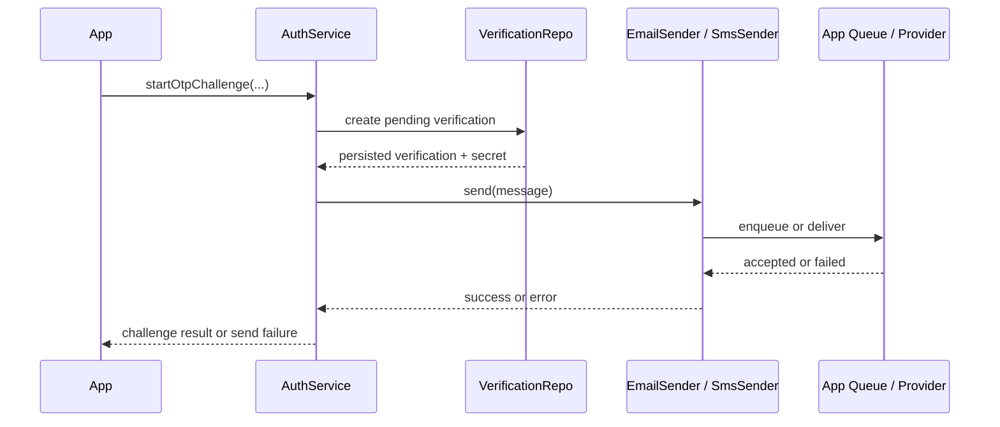

# OTP Delivery Boundary

This document defines the production delivery orchestration boundary for OTP email and SMS sends.

It preserves the current UniAuth sender-port model and explains how applications can add queue,
retry, and dead-letter behavior without changing the OTP lifecycle.

## Decision Summary

Keep the current core contract:

- UniAuth creates and stores the verification first;
- UniAuth then calls `EmailSender` or `SmsSender`;
- sender side effects stay outside `UnitOfWork`;
- sender failure does not roll back the verification record;
- queue, retry, dead-letter, bounce handling, and provider-specific delivery state remain
  application-owned or adapter-owned concerns.

UniAuth does not add a new `DeliveryDispatcher`, delivery repository, verification status, or audit
event type for provider delivery attempts.

## Current Core Flow

The sender can deliver directly or enqueue work. From core's point of view both are the same
contract: `send(...)` is an app-owned side effect after verification persistence.

For a small HTTP-facing composition example around `startOtpChallenge(...)`,
`finishOtpSignIn(...)`, app-owned sender wiring, and session-cookie issuance, see
application-owned OTP route.

Applications that need to poll or inspect one verification record after creation can do that
through the trusted `authService.admin.verifications.get(verificationId)` read-side helper. Prefer
`toVerificationStatusView(...)` before serializing outward-facing responses, and never expose
`secretHash` outside trusted server-side tooling.

If the backend also needs resend countdown or cooldown reads, prefer
`authService.admin.verifications.resendWindow(...)` from a trusted server route instead of deriving
timers in the browser. See [OTP and magic-link abuse-control recipes](abuse-control.md).

## What Core Owns

UniAuth owns only the generic auth semantics:

- normalized OTP target handling;
- verification creation before delivery;
- hash-only verification secret storage;
- consume-once finish semantics;
- neutral account-state behavior;
- rate-limit hooks before start and finish;
- leaving the verification pending if delivery fails.

That last rule is intentional. A failed send does not mean the secret became invalid. It only means
the external delivery side effect failed or was not accepted by downstream infrastructure.

## What Core Does Not Own

UniAuth does not own:

- retry schedules or backoff policies;
- queue backend choice such as BullMQ, SQS, Cloud Tasks, Redis streams, or provider-native queues;
- bounce, complaint, or delivery webhook ingestion;
- delivery-attempt counters;
- dead-letter queues and replay tooling;
- provider-specific message templates, localization, or payload shaping;
- exhausted-delivery operational policy.

Those are delivery infrastructure concerns, not auth-domain state transitions.

## Queue-Backed Composition

The recommended production pattern is to keep the current sender ports and implement queueing inside
the sender adapter:

1. `AuthService.public.otp.start(...)` creates the pending verification and plain secret.
2. An `EmailSender` or `SmsSender` adapter enqueues a delivery job instead of talking to the vendor
   inline.
3. A worker later sends the message through SMTP, SES, Twilio, Vonage, or another provider.
4. Retry, backoff, DLQ, and webhook handling stay inside that queue or provider integration layer.

This keeps the OTP lifecycle stable for existing applications and avoids making one queue model a
core dependency.

## Exhausted Delivery Semantics

When retries are exhausted, core still should not mutate verification state into a special
"delivery failed" auth status.

The recommended meaning is:

- the verification remains pending until normal TTL expiry, successful consumption, or explicit
  adapter cleanup;
- the application may record delivery state in queue storage, provider logs, adapter metadata, or
  its own observability tables;
- the application may choose to stop retries, mark the job dead-lettered, or proactively delete the
  pending verification through an app-owned cleanup path.

UniAuth intentionally does not infer that exhausted delivery changes ownership, secrecy, or
verification validity.

## Why No New Core Dispatcher

A `DeliveryDispatcher`-style core port would blur the boundary:

- it would push queue semantics into the auth package;
- it would create pressure for generic retry metadata, attempt counters, and exhausted states;
- it would still not remove the need for provider-specific workers, webhooks, and observability.

The current sender ports are already enough for direct delivery and queued delivery.

## Delivery Tracking and Audit

UniAuth does not add generic auth audit events for provider delivery attempts.

Reasoning:

- delivery acceptance and retries are infrastructure telemetry, not user identity state;
- provider webhooks are often noisy and vendor-specific;
- a generic core audit surface would either be too weak to be useful or too coupled to delivery
  vendors.

If an application needs delivery audit or observability, it should emit adapter-owned logs or store
application-owned delivery events outside the core auth event model.

## Public Behavior Requirements

Applications should preserve these external behaviors:

- start responses remain neutral about account existence;
- sender failures must not expose whether the target account exists;
- retry and dead-letter identifiers must not leak in public error payloads;
- cleanup logic must not invalidate a successfully delivered verification that is still within TTL
  unless the application explicitly chooses that policy.

## Current Core Test Coverage

Core-owned delivery semantics are already covered by generic tests:

- [tests/unit/core/otp-and-verifications.test.ts](../tests/unit/core/otp-and-verifications.test.ts): failed OTP
  delivery leaves a pending verification;
- [tests/unit/magic-link.test.ts](../tests/unit/magic-link.test.ts): failed magic-link creation or delivery
  keeps the verification pending;
- [tests/unit/password.test.ts](../tests/unit/password.test.ts): failed password-recovery link creation or
  delivery keeps the verification pending;
- [tests/unit/rate-limit.test.ts](../tests/unit/rate-limit.test.ts): OTP start rate-limit denial happens before
  verification creation or send side effects.

Those tests are intentionally provider-agnostic. Provider-specific retry workers, webhook payloads,
and DLQ tooling should be tested in optional adapter packages or in application code.
